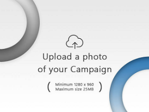

# Image-Cropper-AJAX-Laravel-5.4
This project is developed in Laravel 5.4. Before actual submitting the form you can crop it. Image will be reflected real time and at the same time, image will be saved in the folder

## Installation

1. Download or Clone the repository 
2. Keep this project in server or XAMPP
3. Click on the default image.(Acts as a browse button). After cropping image will be reflected there itself in realtime
4. I have commented the code properly for better understanding
5. Image will be uploaded in resources/views/upload directory
6. You can reupload the image
7. Extract vendor.zip in root directory

## Snippet

1. Routes(i.e. routes/web.php):
```
Route::get('/', function () {
    //return view('welcome');

    return view('frontend.image');
})->name('/');

Route::post('/postImage', [
	'uses' => 'CampaignController@postImage',
	'as' => 'postImage'
]);


```

2. Controller (i.e. app/http/controllers/CampaignController):
```
<?php

namespace App\Http\Controllers;

use App\User;
use App\Http\Controllers\Controller;
use DB;
use Illuminate\Http\Request;
use Illuminate\Routing\Redirector;
use Session;
use Illuminate\Contracts\Validation\Validator;


session_start();

class CampaignController extends Controller
{
	
		public function image() {
			return view('frontend.image');
		}

		public function postImage() {
			//echo "HIIIIII";

			$data = $_POST['image'];

			list($type, $data) = explode(';', $data);
			list(, $data)      = explode(',', $data);

			$data = base64_decode($data);
			$imageName = time().'.png';
			file_put_contents('resources/views/upload/'.$imageName, $data);

			echo "Image Uploaded";
		}


/* ============ Added for Image Cropper of Campaign Card: End ============ */


		
}	/*End CampaignController Class*/


```

3. View (i.e. resources/views/frontend/image.blade.php):
```


<html lang="en">
<head>
<meta name="_token" content="{{ csrf_token() }}" /> 
  <title>PHP - jquery ajax crop image before upload using croppie plugins</title>
  <script src="http://demo.itsolutionstuff.com/plugin/jquery.js"></script>
  <script src="http://demo.itsolutionstuff.com/plugin/croppie.js"></script>
  <link rel="stylesheet" href="https://maxcdn.bootstrapcdn.com/bootstrap/3.3.7/css/bootstrap.min.css">
  <!-- <script src="https://ajax.googleapis.com/ajax/libs/jquery/3.2.0/jquery.min.js"></script> -->
  <script src="https://maxcdn.bootstrapcdn.com/bootstrap/3.3.7/js/bootstrap.min.js"></script>
  <link rel="stylesheet" href="http://demo.itsolutionstuff.com/plugin/croppie.css">
  <link href="https://maxcdn.bootstrapcdn.com/font-awesome/4.7.0/css/font-awesome.min.css" rel="stylesheet" integrity="sha384-wvfXpqpZZVQGK6TAh5PVlGOfQNHSoD2xbE+QkPxCAFlNEevoEH3Sl0sibVcOQVnN" crossorigin="anonymous">
  <style>
  	.uploadimg
  	{
  		position: absolute;
  		top:0;
  	}
  	#upload-demo
  	{
  		position: relative;
  	}

  .image-upload > input {
  	visibility:hidden;
  	width:0;
  	height:0;
  	background:transparent;
}

#upload-demo-i
{
	position: absolute;
	top:0;
}
  </style>


</head>
<body>

<div class="image-upload">
		<label for="upload">
		    				
		  				</label>
		<input type="file" id="upload" data-target="#myModal" data-toggle="modal" >
		

		<div id="upload-demo-i" style="cursor: pointer" onclick="editImage()"></div>
</div>


  <div id="myModal" class="modal fade " role="dialog">
  <div class="modal-dialog">

    <!-- Modal content-->
    <div class="modal-content">
      	<div class="modal-header">
        	<button type="button"   style=" "class="close" data-dismiss="modal">&times;</button>
      
      	</div>
      	<div class="modal-body">
          
      		<div id="upload-demo" style="width:350px"></div>

      		<button class="btn btn-success upload-result" data-dismiss="modal">Upload Image</button>
     
    	</div>
    </div>

  </div>
</div>

<script type="text/javascript">
$uploadCrop = $('#upload-demo').croppie({
    enableExif: true,
    viewport: {
        width: 300,
        height: 225,
        type: 'rectangle'
    },
    boundary: {
        width: 300,
        height: 300
    }
});

$('#upload').on('change', function () { 
	var reader = new FileReader();
    reader.onload = function (e) {
    	$uploadCrop.croppie('bind', {
    		url: e.target.result
    	}).then(function(){
    		console.log('jQuery bind complete');
    	});
    	
    }
    reader.readAsDataURL(this.files[0]);
});

$('.upload-result').on('click', function (ev) {
	$uploadCrop.croppie('result', {
		type: 'canvas',
		size: 'viewport'
	}).then(function (resp) {

	$.ajax({
			url: "postImage",
			type: "POST",
			data: {
				"_token": "{{ csrf_token() }}",
				"image":resp
			},
			success: function (data) {//alert(data);
				html = '';
				$("#upload-demo-i").html(html);
				console.log(data);
			}
		});
	});
});
/*This function is added for Image Reupload Facility: Start*/
function editImage() {
  //alert("hiiiiiii");
  
  location.reload(true);
  editImage2();
  

}

function editImage() {
  $("#upload").click();
}

/*This function is added for Image Reupload Facility: End*/


</script>


</body>
</html>


```
	

## Looks


<br/><br/><br/>


<br/><br/><br/>


<br/><br/><br/>


<br/><br/><br/>


<br/><br/><br/>


## License

(The MIT License)

Copyright (c) 2017 Amir Mustafa

Permission is hereby granted, free of charge, to any person obtaining
a copy of this software and associated documentation files (the
'Software'), to deal in the Software without restriction, including
without limitation the rights to use, copy, modify, merge, publish,
distribute, sublicense, and/or sell copies of the Software, and to
permit persons to whom the Software is furnished to do so, subject to
the following conditions:

The above copyright notice and this permission notice shall be
included in all copies or substantial portions of the Software.

THE SOFTWARE IS PROVIDED 'AS IS', WITHOUT WARRANTY OF ANY KIND,
EXPRESS OR IMPLIED, INCLUDING BUT NOT LIMITED TO THE WARRANTIES OF
MERCHANTABILITY, FITNESS FOR A PARTICULAR PURPOSE AND NONINFRINGEMENT.
IN NO EVENT SHALL THE AUTHORS OR COPYRIGHT HOLDERS BE LIABLE FOR ANY
CLAIM, DAMAGES OR OTHER LIABILITY, WHETHER IN AN ACTION OF CONTRACT,
TORT OR OTHERWISE, ARISING FROM, OUT OF OR IN CONNECTION WITH THE
SOFTWARE OR THE USE OR OTHER DEALINGS IN THE SOFTWARE.
